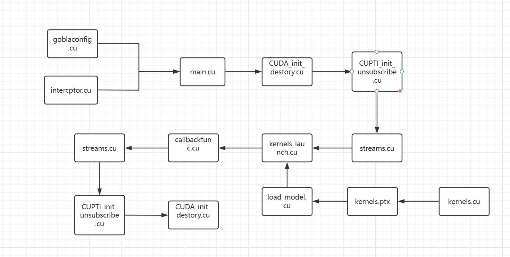

# 使用cupti拦截多并发kernel launch


## 拦截原理


> **原理**
>拦截 CUDA 内核（kernel）执行的原理基于 CUPTI（CUDA Profiling Tools Interface）提供的回调机制。通过 CUPTI 提供的回调机制，开发者可以在内核执行之前和之后插入自定义代码，这就是所谓的拦截内核执行。其核心思想是通过注册回调函数，在 CUDA Driver API 或 Runtime API 函数调用时，捕获这些函数的执行时机，进而对 CUDA 内核启动进行拦截或监控。

**本文的并发采取的是多流模式(在所有核函数使用同一个流也可以)**
**回调函数将拦截到的核函数指针指向null,所以核函数无法正常启动，批量释放的时候，重新获取原函数指针，所用的流也是原函数的流**
### 流程

#### 1. 注册回调函数

通过 `cuptiSubscribe()` 函数，开发者可以注册一个回调函数，该函数会在 CUDA 内核启动时被调用,监控cuda程序的行为。注册时，需要指定回调函数的域（domain），比如 `CUPTI_CB_DOMAIN_DRIVER_API` 表示 CUDA Driver API，或者 `CUPTI_CB_DOMAIN_RUNTIME_API` 表示 CUDA Runtime API。
**CUDA Runtime API**（运行时 API）：

* **更高层次的抽象**，更易于使用。
* 适合大多数开发者，提供了一些默认配置，简化了 CUDA 编程的难度。
* 通常用于与 CUDA 驱动层打交道较少的场景，例如标准的 CUDA 程序编写。
* 需要 CUDA 库（`libcudart.so`）的支持。

**CUDA Driver API**（驱动 API）：

* **低层次的 API**，更接近硬件，提供了更高的灵活性和控制。
* 对比 Runtime API 更复杂，但适合那些需要对设备和内存管理进行更细粒度控制的场景。
* 不需要 CUDA 运行时库的支持，可以直接与 CUDA 驱动打交道。

**本文监控的是`CUDA driver API`,检测cuda runtime API 时拦截不成功**


#### 2.启用回调功能

使用 `cuptiEnableCallback()` 启用对特定 CUDA API 的回调，例如 `cuLaunchKernel` 或 `cudaLaunchKernel`。当这些 API 被调用时，CUPTI 会执行事先注册的回调函数。

```c
cuptiEnableCallback(1, subscriber, CUPTI_CB_DOMAIN_DRIVER_API, CUPTI_DRIVER_TRACE_CBID_cuLaunchKernel);
```

#### 3. 实现回调函数

回调函数的实现是拦截 CUDA 内核的核心。在回调函数中，可以访问即将启动的内核的参数。通过修改这些参数，可以控制内核的执行。

* **获取内核参数**：通过 `cbInfo->functionParams` 可以获取内核的启动参数，例如网格维度、块维度、共享内存大小等。
* **修改内核参数**：可以通过修改回调函数中的参数，来更改内核的启动行为，甚至可以通过将网格大小设置为零或将函数指针置为 NULL 来阻止内核执行。

示例代码：
```c
void CUPTIAPI cuptiCallback(void *userdata, CUpti_CallbackDomain domain,
                            CUpti_CallbackId cbid, const CUpti_CallbackData *cbInfo) {
    if (domain == CUPTI_CB_DOMAIN_DRIVER_API && cbid == CUPTI_DRIVER_TRACE_CBID_cuLaunchKernel) {
        if (cbInfo->callbackSite == CUPTI_API_ENTER) {
            // 获取 cuLaunchKernel 的参数
            const cuLaunchKernel_params *params = (const cuLaunchKernel_params *)(cbInfo->functionParams);
            
            // 可以在这里修改内核启动的参数，比如阻止内核执行
            ((cuLaunchKernel_params *)(cbInfo->functionParams))->gridDimX = 0;
            printf("Intercepted and blocked kernel launch!\n");
        }
    }
}
```

#### 4. 启动内核的拦截

在回调函数中，如果检测到满足特定条件（例如，启动了足够数量的内核），可以批量启动所有被拦截的内核。开发者可以手动调用 `cudaLaunchKernel()` 或 `cuLaunchKernel()` 来执行内核。

#### 5. 处理活动信息

CUPTI 还可以用来记录内核的执行时间、内存操作等。开发者可以通过 `cuptiActivityEnable()` 启用活动记录，从而跟踪内核的执行时间等关键信息。

---

### 流程图


---
## User Guide

### 调试与编译

**实验环境**：

```bash
$ lsb_release -a
No LSB modules are available.
Distributor ID: Ubuntu
Description:    Ubuntu 22.04.5 LTS
Release:        22.04
Codename:       jammy

$ nvcc -V
nvcc: NVIDIA (R) Cuda compiler driver
Copyright (c) 2005-2024 NVIDIA Corporation
Built on Wed_Apr_17_19:19:55_PDT_2024
Cuda compilation tools, release 12.5, V12.5.40
Build cuda_12.5.r12.5/compiler.34177558_0

$ nvida-smi
   
+-----------------------------------------------------------------------------------------+
| NVIDIA-SMI 555.42.02              Driver Version: 555.42.02      CUDA Version: 12.5     |
|-----------------------------------------+------------------------+----------------------+
| GPU  Name                 Persistence-M | Bus-Id          Disp.A | Volatile Uncorr. ECC |
| Fan  Temp   Perf          Pwr:Usage/Cap |           Memory-Usage | GPU-Util  Compute M. |
|                                         |                        |               MIG M. |
|=========================================+========================+======================|
|   0  NVIDIA RTX A6000               Off |   00000000:31:00.0 Off |                  Off |
| 30%   26C    P8             26W /  300W |       2MiB /  49140MiB |      0%      Default |
|                                         |                        |                  N/A |
+-----------------------------------------+------------------------+----------------------+
|   1  NVIDIA RTX A6000               Off |   00000000:B1:00.0 Off |                  Off |
| 30%   26C    P8             29W /  300W |       2MiB /  49140MiB |      0%      Default |
|                                         |                        |                  N/A |
+-----------------------------------------+------------------------+----------------------+
```
`debug`:
本项目可以一键debug(shift + F5),其中调试配置在Cmakelist.txt文件中设置即可。也可自己build一个项目，将 `*.cu`和`*.h`复制即可。vscode c++/c调试设置参见https://fancyerii.github.io/2024/01/17/vscode-cuda-debug/。


`make`:
执行可执行文件`./intercptor_launch`
或者先`make clean`和删除`./intercptor_launch`,再`make`
如果遇问题检查Makefile
`NVCCFLAGS = -arch=sm_86 -I/usr/local/cuda-12.5/include --compiler-options '-fPIC'
LDFLAGS = -L/usr/local/cuda-12.5/lib64 -lcuda -lcudart -lcupti`设置为本地路径即可

> -arch需要根据GPU类型更新， 如3090卡是sm_86, T1000卡为sm_75
> 
> LDFLAGS和NVCCFLAGS需要添加CUPTI相关路径

---
## Developer guide

### 准备工作：
### 1. 变量定义和声明
`main.cu`:
```bash
// 定义内核函数指针
CUfunction matrixAdd_func = nullptr;
CUfunction matrixSub_func = nullptr;
CUfunction matrixMul_func = nullptr;

KernelFunction kernelFunctions[] = {
    {&matrixAdd_func, "matrixAdd",4},
    {&matrixSub_func, "matrixSub",4},
    {&matrixMul_func, "matrixMul",4}
};

int kernel_nums = 3;
```
* CUfunction matrixAdd_func = nullptr; 函数指针初始化 
* KernelFunction kernelFunctions[] 是函数指针与函数名的映射信息，第三个参数为核函数传递参数的数量
* int kernel_nums为核函数的数量
* 
`globalconfig.h`：声明变量和函数指针映射等
```bash
// 型枚举,在回调函数中识别函数类别
typedef enum {
    KERNEL_UNKNOWN,
    KERNEL_MATRIX_ADD,
    KERNEL_MATRIX_SUB,
    KERNEL_MATRIX_MUL
} KernelType;

// 声明全局变量，其中matrixAdd_func为mian.cu中定义的函数指针
extern CUfunction matrixAdd_func;
extern CUfunction matrixSub_func;
extern CUfunction matrixMul_func;

// 使用 constexpr 来定义编译时常量
constexpr int KERNEL_THRESHOLD = 2;
constexpr int MAX_KERNELS = 1000;

// 启动函数声明
void launchMatrixAdd(dim3 gridDim, dim3 blockDim, CUstream stream,
                    CUdeviceptr d_A, CUdeviceptr d_B, CUdeviceptr d_C, int N);
void launchMatrixSub(dim3 gridDim, dim3 blockDim, CUstream stream,
                    CUdeviceptr d_A, CUdeviceptr d_B, CUdeviceptr d_C, int N);
void launchMatrixMul(dim3 gridDim, dim3 blockDim, CUstream stream,
                    CUdeviceptr d_A, CUdeviceptr d_B, CUdeviceptr d_C, int N);
```

`constexpr int KERNEL_THRESHOLD = 2;`:拦截的kernel的数量
`constexpr int MAX_KERNELS = 1000;`:拦截队列中最大值，防止死循环
### 2. 在kernels.cu定义核函数：
```bash
extern "C" __global__ void matrixAdd(int* A, int* B, int* C, int N) {
    int i = blockIdx.y * blockDim.y + threadIdx.y;
    int j = blockIdx.x * blockDim.x + threadIdx.x;
    if (i < N && j < N) {
        int idx = i * N + j;
        C[idx] = A[idx] + B[idx];
    }
}
```
一定要加`extern "C"`表示，否则c++为避免重命名会将核函数名称编码成其他名称，导致后续回调函数函数中找不到函数名。

### 3. 将kernels.cu编译成.ptx 模块文件
### 4. 定义启动函数kernel_launch.cu

```bash
void launchMatrixAdd(dim3 gridDim, dim3 blockDim, c,
                    CUdeviceptr d_A, CUdeviceptr d_B, CUdeviceptr d_C, int N) {
    currentKernelType = KERNEL_MATRIX_ADD;

```
* dim3 gridDim
* dim3 blockdDim
* CUstream stream ：流
* CUdeviceptr d_A, CUdeviceptr d_B, CUdeviceptr d_C, int N：核函数的参数

## 编写main.cu流程:
1. 初始化cuda设备
2. 初始化并订阅CUPTI
3. 加载核函数模块(.ptx)和映射列表
4. 核函数的其他需求(内存申请、初始化等)
5. 数据拷贝（host -> device)
6. 定义 线程块和网格尺寸等
7. 创建cuda流（多个核函数再同一个流中也可以）
8. 启动内核
9. CUPTI自动拦截
10. 等待结果
11. 数据拷贝（device -> host)
12. 打印结果
13. 释放内存
14. 销毁流、取消订阅、销毁cuda context
15. over！


