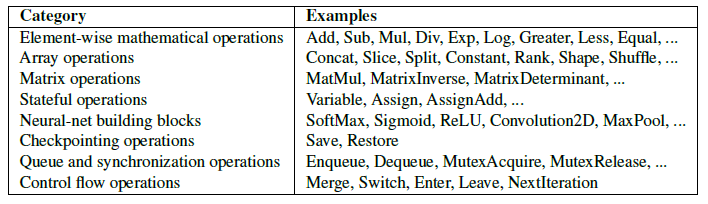

# tensorflow底层架构

## 架构图


1. **Training libraries 和 Inference libs（训练库和推理库）**

* **Training libraries**：用于模型的训练过程，包括定义模型、计算梯度、更新模型权重等。这些库提供了在训练过程中所需的所有功能。
* **Inference libs**：用于模型的推理过程，主要用于在训练完成后将模型应用于实际数据的预测任务。

2. **Python client 和 C++ client**

* **Python client**：Python 是 TensorFlow 的主要接口，用户通常通过 Python 来定义计算图、构建模型和执行操作。Python API 易于使用，适合快速开发和原型设计。
* **C++ client**：C++ API 提供更高的性能，适用于高效执行深度学习模型的推理任务，特别是在需要高性能的情况下，比如在嵌入式系统或生产环境中。

3. **C API**

* **C API**：这是一个底层的接口，提供对 TensorFlow 核心功能的访问。C API 允许不同的客户端（如 Python 和 C++）与 TensorFlow 系统进行交互，执行各种计算任务。

4. **Distributed master 和 Dataflow executor（分布式主节点和数据流执行器）**

* **Distributed master**：在分布式计算中，TensorFlow 的分布式主节点负责管理不同设备上的计算任务，协调它们之间的数据传输和工作负载分配。这允许模型训练和推理能够在多台机器或多种设备上进行。
* **Dataflow executor**：数据流执行器负责执行计算图中的操作。在 TensorFlow 中，计算被表示为有向无环图（DAG），每个节点代表一个操作（算子）。数据流执行器遍历图，并按顺序执行每个操作。

5. **Kernel implementations（内核实现）**

* 这一层展示了 TensorFlow 内核中不同算子的实现，包括：
  * **Const**：常量操作，用于在计算图中定义不变的数据。
  * **Var**：变量操作，用于定义可以在训练过程中更新的权重或参数。
  * **MatMul**：矩阵乘法操作，广泛用于神经网络的前向和后向传播计算中。
  * **Conv2D**：二维卷积操作，是卷积神经网络（CNN）中的核心操作。
  * **ReLU**：激活函数操作（Rectified Linear Unit），用于引入非线性。
  * **Queue**：队列操作，通常用于管理输入数据的流动。
* 这些内核实现表示了 TensorFlow 中执行的实际操作，是核心的计算组件。

6. **Networking layer（网络层）**

* **RPC** 和 **RDMA**：这些是远程过程调用（Remote Procedure Call）和远程直接内存访问（Remote Direct Memory Access）技术，主要用于在分布式系统中进行高效的网络通信。它们使得不同的设备或机器之间可以快速传递数据和操作指令。

7. **Device layer（设备层）**

* **CPU** 和 **GPU**：这是计算设备层。TensorFlow 的架构支持在多种硬件上执行计算，最常见的设备是 CPU 和 GPU。GPU 因为其高度并行计算的能力，通常被用于加速深度学习模型的训练和推理。
* TensorFlow 可以根据操作的类型和数据的大小自动选择适当的设备进行计算，以提高效率。


### 总结

TensorFlow 的架构分为多个层次，从上层的 Python 和 C++ 客户端到底层的设备管理和分布式计算。上层提供了用户友好的 API，用于定义和执行计算图；中层处理数据流的执行和分布式计算；底层则负责与硬件设备的交互，确保计算任务能够高效地在不同设备上执行。这种分层结构使得 TensorFlow 既能方便用户使用，也能够高效处理大规模的深度学习任务。

------

## 计算流程

**Tensorflow** 实际运行的时候会先将 python 代码定义的网络结构解析为一个有向无环的计算图，通过这个计算图再调度计算资源运行模型。

**计算图**是包含一组 [`tf.Operation`](https://www.tensorflow.org/api_docs/python/tf/Operation?hl=zh-cn) 对象（表示计算单元）和 [`tf.Tensor`](https://www.tensorflow.org/api_docs/python/tf/Tensor?hl=zh-cn) 对象（表示在运算之间流动的数据单元）的数据结构。**计算图在 [`tf.Graph`](https://www.tensorflow.org/api_docs/python/tf/Graph?hl=zh-cn) 上下文中定义。由于这些计算图是数据结构，无需原始 Python 代码即可保存、运行和恢复它们。

**算子**（Operation 或 Op） 是计算图中的基本单位，负责执行特定的操作。每个算子会在计算图的节点上执行特定的数学计算或数据操作，诸如加法、矩阵乘法、卷积等。张量（Tensor）在算子之间传递，最终构成完整的计算流程 。

TF白皮书对内置op的分类总结如下：



**张量（Tensor）** 是一种多维数组，是机器学习和深度学习中表示数据的基本单位。张量可以有不同的维度，用于存储标量、向量、矩阵或更高维度的数据。在 TensorFlow 和其他深度学习框架中，所有的数据和操作都是基于张量进行的。

#### <u>_计算图示例_</u>


这个计算图中的每一个节点，除了输入和输出节点外，每个中间的节点都代表对张量 (Tensor) 的一个操作。从 checkpoint 目录下的 graph.pbtxt 文件中，我们可以找到每一个节点的结构，例如一个矩阵乘法的节点：
```c++
node {
   name: "dnn/dense/MatMul"
   op: "MatMul"
   input: "dnn/input_layer/Reshape_143"
   input: "dense/kernel/read"
   attr {
     key: "T"
     value {
       type: DT_FLOAT
     }
   }
   ...
 }

```
我们可以看到每个节点有几个域：name、op、input、attr，其中 name、input、attr 都很容易理解，分别是节点的名字、输入 tensor 以及节点的额外属性，op ——算子(Operator)，是张量操作的具体实现。

***内核调用的实际流程:(以 MatMul 为例，假设在 GPU 上执行)***


> 1.Python 代码调用 tf.matmul： 当调用 tf.matmul(A, B) 时，TensorFlow 会在计算图中创建一个 MatMul 节点。

> 2.构建计算图： TensorFlow 将 MatMul 节点添加到计算图中，并记录该节点的 op 为 MatMul，输入为张量 A 和 B。

> 3.编译计算图： TensorFlow 会编译计算图，在编译过程中，识别到 MatMul 节点需要调用矩阵乘法的内核。

> 4.内核选择： TensorFlow 查询内核注册表，找到与 MatMul 操作相关联的 CUDA 内核（如果是在 GPU 上运行）。

> 5.调用内核： TensorFlow 将 A 和 B 的数据传递给 CUDA 矩阵乘法内核（如 cublasSgemm 或 cublasDgemm，根据数据类型选择），并在 GPU 上执行实际的矩阵乘法计算。

> 6.结果返回： 内核执行完成后，结果张量被返回，并传递给计算图中的下一个节点。

### 计算图中其他节点详情

主图中展示了模型的主要层和计算操作，它们构成了模型的核心。

* **flatten** 和 **flatten_1**：
  * 这两个节点表示神经网络中的 "flatten" 操作，它将输入数据展平（例如，将多维张量变为一维）。这些操作通常是连接全连接层（Dense 层）前的必要步骤。
* **dense**、**dense_1**、**dense_2** 和 **dense_3**：
  * 这些节点表示全连接层（Dense layer），是神经网络中的关键层之一。它们执行线性变换并加上偏置项，通常后接激活函数。这些层中的参数会在训练过程中更新。
* **dropout** 和 **dropout_1**：
  * Dropout 层用于正则化神经网络，以防止过拟合。它随机丢弃一部分神经元，确保模型不会过度依赖某些特定的特征。
* **metrics 和 metrics_1**：
  * 这些节点表示模型的评估指标，例如准确率（accuracy）或损失值（loss）。这些指标通常用于在训练或评估模型时进行模型性能的评估。
* **loss 和 loss_1**：
  * 这些是损失函数节点，计算预测输出与真实标签之间的误差。这些误差被用于更新模型的参数。
* **数据流箭头**：
  * 箭头表示数据的流动。每个节点的输出成为下一个节点的输入。节点之间的连接说明了神经网络层之间的顺序和依赖关系。
* **Const（常量）**：
  * 这个节点表示一个常量值，它通常不会在训练过程中改变，而是作为输入或参数传递给网络的其他节点。

**Auxiliary Nodes（辅助节点）**

辅助节点表示一些与训练和计算相关的操作，但它们不直接参与模型的前向传播或预测中。

* training 和 training_1


  * 这些节点表示训练过程中的一些辅助操作。通常在训练时，模型会涉及到如优化器、参数更新、学习率调整等操作，这些操作被封装在这些训练节点中。

* loss_1_dense_3


  * 这个节点表示与模型中的损失计算相关的操作，通常会在反向传播中使用，用于计算梯度并调整模型参数。
**<u>计算图中的细节展示</u>**


----
### **Reference:**
1. https://kirivir.github.io/articles/2021/10/10/1633876194557.html
2. https://www.tensorflow.org/tensorboard/graphs
3. https://www.tensorflow.org/guide/intro_to_graphs?hl=zh-cn
4. https://www.tensorflow.org/guide/intro_to_graphs
5. https://www.tensorflow.org/api_docs/python/tf/add
6. https://www.tensorflow.org/api_docs/python/tf/linalg/matmul
7. https://www.tensorflow.org/api_docs/python/tf/nn/conv2d
8. https://www.tensorflow.org/guide/tensor
9. https://www.tensorflow.org/api_docs/python/tf/Tensor
10. https://www.deeplearning.ai/

---


